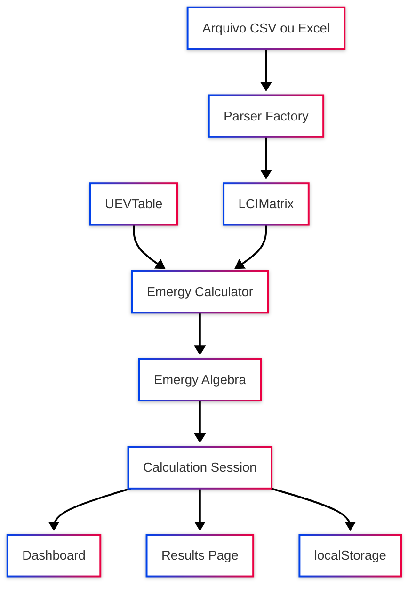

# SCALE-Web — Sistema de Cálculo Emergético

> Aplicação web inspirada no software SCALE (Marvuglia et al., 2013) para cálculo emergético a partir de matrizes LCI, com visualização de fluxos, importação de dados e geração de relatórios.

[](https://www.typescriptlang.org/)
[](https://nextjs.org/)
[](https://react.dev/)
[](https://tailwindcss.com/)
[](https://mathjs.org/)
[](https://recharts.org/)
[](https://d3js.org/)
[](https://jestjs.io/)
[](https://vercel.com/)

---

## Demo ao vivo

- **Frontend:** `scaleweb-project.vercel.app`

---

## Índice

- [Sobre](#sobre)
- [Stack tecnológica](#stack-tecnológica)
- [Arquitetura](#arquitetura)
- [Estrutura do projeto](#estrutura-do-projeto)
- [Como rodar](#como-rodar)
- [Páginas](#páginas)
- [Exemplos LCI](#exemplos-lci)
- [Formato do CSV](#formato-do-csv)
- [Testes](#testes)
- [Referências](#referências)

---

## Sobre

O **SCALE-Web** aplica as regras da álgebra emergética (Odum, 1996) sobre redes de processos interconectados descritas por inventários de ciclo de vida (LCI). O sistema resolve o modelo matricial de Leontief, calcula emergia por processo, índices emergéticos (EYR, ELR, ESI, transformidade) e oferece visualizações interativas no navegador — sem servidor externo para os cálculos.

Desenvolvido como APS da disciplina de Engenharia de Software — UNIP, 7º Semestre 2026.

---

## Stack tecnológica

| Tecnologia | Uso |
|---|---|
| **Next.js 16** | App Router, SSR/CSR, deploy na Vercel |
| **React 19** | Interface e estado (Context API) |
| **TypeScript** | Tipagem estrita em todo o projeto |
| **Tailwind CSS v4** | Estilização e tema dark/light pastel |
| **mathjs** | Álgebra matricial — `(I − A)⁻¹ · g` |
| **papaparse** | Parse de arquivos CSV |
| **xlsx (SheetJS)** | Importação de planilhas Excel |
| **Recharts** | Gráfico de barras — emergia por processo |
| **D3.js** | Diagrama force-directed de fluxos emergéticos |
| **Jest** | Testes unitários e de integração (TDD) |
| **Lucide React** | Ícones da interface |

---

## Arquitetura



**Padrões aplicados:**

| Padrão | Onde |
|---|---|
| **Strategy** | Regras da álgebra emergética em `algebra.ts` |
| **Factory** | `csvParser` / `excelParser` por tipo de arquivo |
| **Observer** | React Context — sessão propagada às páginas |
| **Facade** | `calculator.ts` — orquestra parse → cálculo → índices |

---

## Estrutura do projeto

```
scaleweb-project/
├── app/
│   ├── dashboard/page.tsx      # Índices + gráfico Recharts
│   ├── lci/page.tsx            # Importação, matriz, UEVs, cálculo
│   ├── results/page.tsx        # D3, tabelas, export CSV/PDF
│   ├── api/calculate/route.ts  # API opcional de cálculo
│   └── page.tsx                # Landing/home
├── components/
│   ├── emergy/                 # EmergySummary, EmergyBarChart, EmergyFlowChart, EmergyStackedChart
│   ├── lci/                    # LCIImporter, MatrixEditor, MatrixPreview
│   ├── layout/                 # Sidebar, Navbar, AppShell
│   ├── providers/              # ThemeProvider
│   └── ui/                     # Button, Card, Table, Badge, FileUpload, Tabs
├── lib/
│   ├── emergy/                 # algebra, calculator, transformers
│   ├── parsers/                # csvParser, excelParser
│   ├── export/                 # csv-export.ts
│   ├── chart-colors.ts
│   └── lci-samples.ts
├── context/session-context.tsx
├── types/emergy.ts
├── __tests__/                  # algebra.test.ts, calculator.test.ts
└── public/
    ├── sample-lci.csv          # Simples — 3 processos
    ├── sample-lci-medium.csv   # Médio — 5 processos
    └── sample-lci-high.csv     # Avançado — 8 processos
```

---

## Como rodar

### Pré-requisitos

- Node.js 20+
- npm (ou pnpm / yarn)

### Instalação

```bash
git clone <url-do-repositorio>
cd scaleweb-project
npm install
```

### Desenvolvimento

```bash
npm run dev
```

Acesse [http://localhost:3000](http://localhost:3000) — redireciona para `/dashboard`.

### Build de produção

```bash
npm run build
npm start
```

### Variáveis de ambiente (opcional)

```env
NEXT_PUBLIC_APP_NAME=SCALE-Web
NEXT_PUBLIC_APP_VERSION=1.0.0
```

---

## Páginas

| Rota | Descrição |
|------|-----------|
| `/dashboard` | Cards EYR, ELR, ESI, transformidade; gráfico de emergia; resumo da sessão |
| `/lci` | Upload CSV/Excel, editor da matriz A e vetor g, UEVs, botão **Calcular Emergia** |
| `/results` | Abas **Rede** (D3), **Composição** (barras empilhadas), **Dados** (tabelas); exportar CSV/PDF |

**Fluxo típico:** `/lci` → carregar exemplo ou importar → ajustar UEVs → calcular → `/dashboard` e `/results`.

---

## Exemplos LCI

Três cenários prontos na página **Gestão LCI**, cada um com botões **Carregar** e **Baixar CSV**:

| Exemplo | Arquivo | Processos | Fluxos | Uso |
|---------|---------|-----------|--------|-----|
| **Simples** | `sample-lci.csv` | 3 | 3 | Primeiro teste, tutorial |
| **Médio** | `sample-lci-medium.csv` | 5 | 5 | Cadeia Extracao → Refino → Fabricacao → Distribuicao → Uso |
| **Avançado** | `sample-lci-high.csv` | 8 | 8 | Rede industrial (mineração até reciclagem) |

Os exemplos médio e avançado ajudam a comparar desempenho do dashboard com mais barras no gráfico, nós no diagrama D3 e variação nos índices emergéticos.

---

## Formato do CSV

```csv
process;Processo_A;Processo_B;Processo_C
Eletricidade;0;0.3;0.1
Combustivel;0.2;0;0.4
Agua;0.1;0.2;0
```

- Primeira linha: nomes dos processos (colunas)
- Demais linhas: fluxos elementares e coeficientes
- Delimitador `;` ou `,` detectado automaticamente

---

## Testes

**9 testes** em 2 suites (`algebra` + `calculator`).

```bash
npm test              # execução única
npm run test:watch    # modo watch
npm run test:coverage # cobertura
```

Cobertura principal:

- `solveLeontief` — sistema 2×2 e matriz singular
- `calculateEmergyIndices` — EYR, ELR, ESI
- Regras de co-produto, split-path e feedback loops
- Pipeline completo LCI → resultados emergéticos

---

## Referências

- Marvuglia, A. et al. SCALE: Software for CALculating Emergy based on life cycle inventories. *Ecological Modelling*, v. 248, p. 80–91, 2013. [doi:10.1016/j.ecolmodel.2012.09.013](https://doi.org/10.1016/j.ecolmodel.2012.09.013)
- Odum, H.T. *Environmental Accounting: Emergy and Environmental Decision Making*. Wiley, 1996.

---

⭐ Se este projeto foi útil, deixe uma estrela no repositório!
